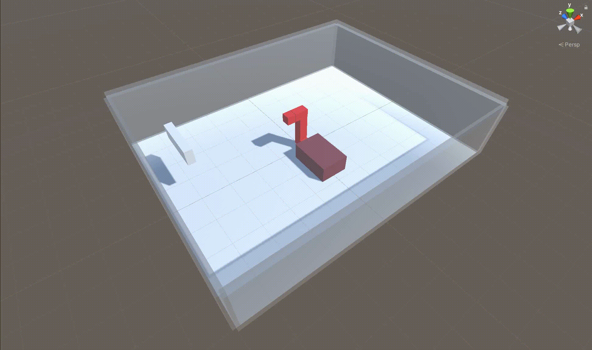
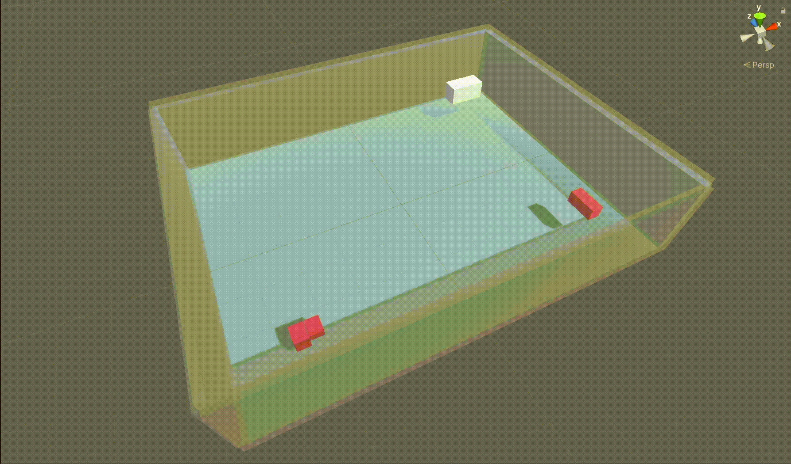

 # Project 01 - AI-Coordinated Plantroom
 ## Source Code Confidential

| The First Breakthrough |
| :------------------: |
||

| Navigate In Single Plane |
| :------------------: | 
| Finally this stupid AI Get smarter...over the weekend |
||

| Navigate In 3D Plane |
| :------------------: | 
| Another Week of Evolve - This snake can finally swim in 3D |
||

| Less Bending Work |
| :------------------: | 
| The AI start to learn to run with less bending|
||

| Clash Avoidance Work |
| :------------------: | 
| Able to avoud obstaces no. But...Horizontal obstacles are still suck|
||

| More Obstacles |
| :------------------: | 
||

| More Obstacles |
| :------------------: | 
||

| Possible to coordinate for Multi-Agents?|
| :------------------: |
||

| 2 snakes without coordination training |
| :------------------: |
||

| 3 snakes without coordination training |
| :------------------: |
||

| The first plantroom done by AI! |
| :------------------: |
| The power of AI|
||

| Still Long Way To Go |
| :------------------: |
