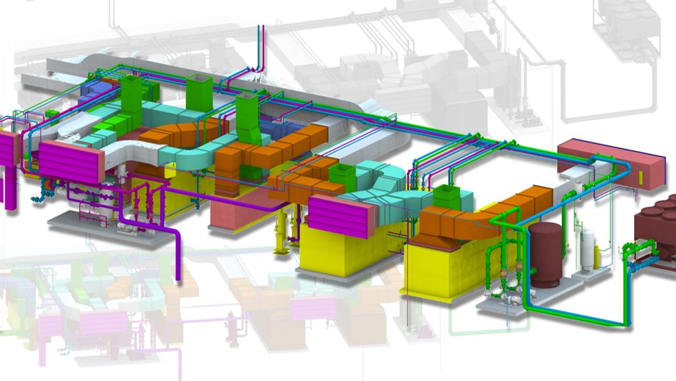
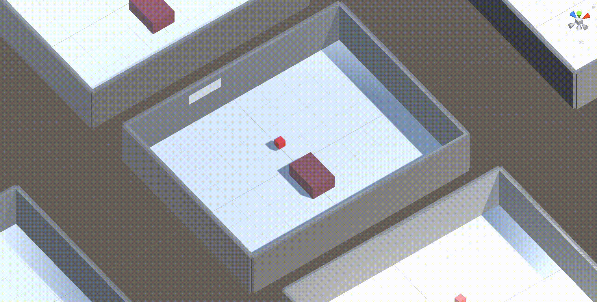
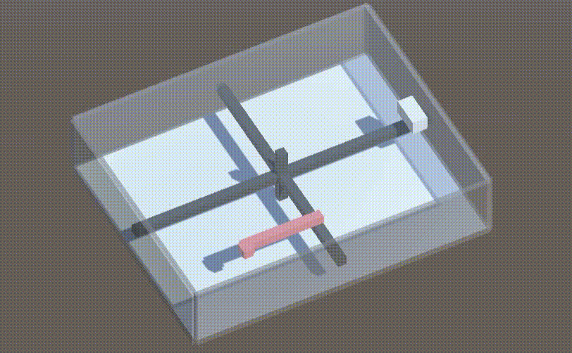
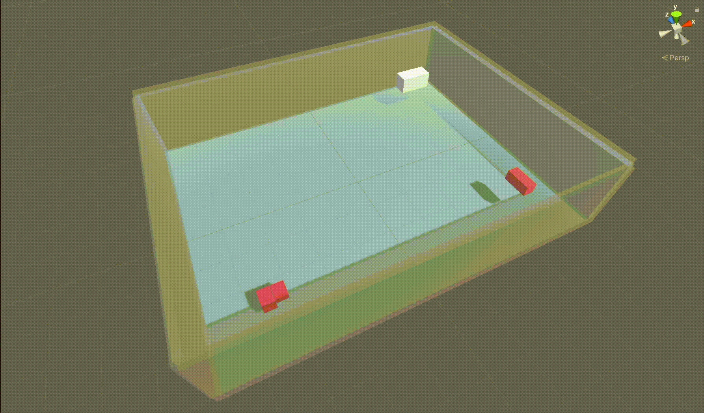
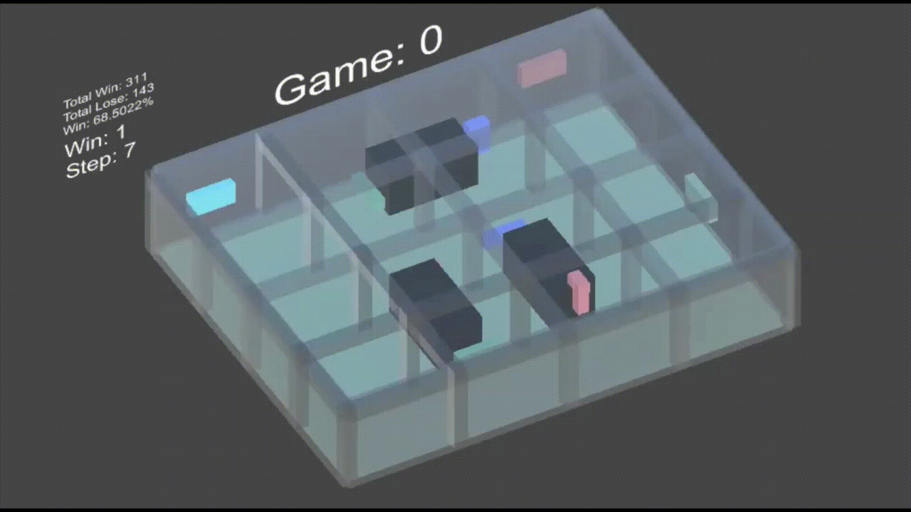

 # Project 01 - AI-Coordinated Plantroom
 ### [---Source Code Confidential---]

| Complicated Plantroom Coordination....:fearful:|
| :------------------ |
||

| Any possibility to making use of RL to solve? :thinking::thinking: |
| :------------------ |
| :bulb: May be something like a snake game? But in 3D and mulit-objectives? :snake: |
| May be super difficult .... :dizzy_face: | 
||

| May be...Lets Try :eyes::eyes:|
| :------------------ |
| The First Breakthrough! :scream:|
||

| Navigate In Single Plane |
| :------------------ | 
| Finally this stupid AI Get smarter:heart_eyes:...over the weekend :worried:|
||

| Navigate In 3D Plane |
| :------------------ | 
| Another Week of Evolve - This snake can finally swim in 3D :sunglasses: |
||

| Less Bending Working Now! |
| :------------------ | 
| The AI start to learn to run with less bending :open_mouth:|
||

| Clash Avoidance Work |
| :------------------ | 
| Able to avoud obstaces no. But...Horizontal obstacles are still suck :sweat::sweat::sweat:|
||

| More Obstacles :astonished:|
| :------------------ | 
||

| And More Obstacles :astonished:|
| :------------------ | 
||

| Now Next.....How's possible for the AI to coordinate for Multi-Agents? :thinking:|
| :------------------ |
||

| Let's see how 2 snakes behave without any training on coordination :snake::snake: |
| :------------------ |
| Quite okay |
||

| Let's see how 3 snakes behave without any training on coordination :snake::snake::snake: |
| :------------------ |
| Not too bad |
||

| With months of trail & error in part time :calendar::calendar::calendar::calendar::calendar::calendar:|
| :------------------ |
||

| :scream: Fainlly! The first plantroom done by AI! :sunglasses::sunglasses:|
| :------------------ |
| The power of AI :scream: |
||

### There is still long way ahead for the successful development. :round_pushpin:
### But it had already made an important small step! :walking:

