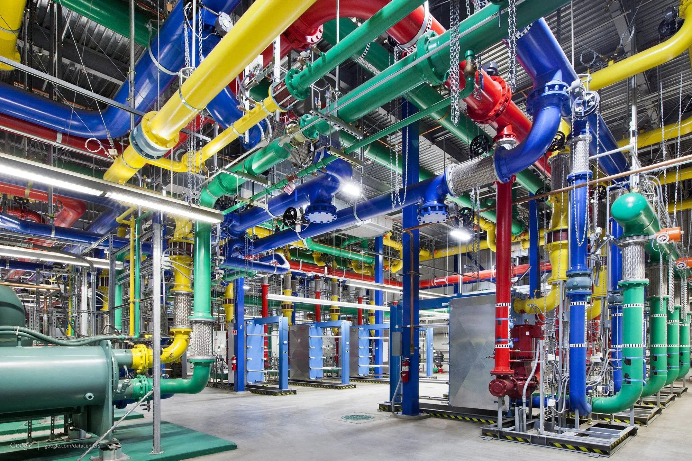

 # Project 01 - AI-Coordinated Plantroom
 ### [---Source Code Confidential---]

| Complicated Plantroom Coordination....:fearful:|
| :------------------ |
||
| Spend hours for Engineers to Design & Coordinate the Services in 3D Environment|
||

| Any possibility to making use of RL to solve the plantroom coordination? :thinking::thinking: |
| :------------------ |
| :bulb: May be something like a snake game? :thinking: |
||
| But in 3D and fulling different engineering requirement? :snake: |
||
| Would that be super difficult to develop?.... :dizzy_face: | 

| Lets try first may be :eyes::eyes:|
| :------------------ |
| The First Breakthrough! :scream:|
||

| Navigate In Single Plane |
| :------------------ | 
| Finally this stupid AI Get smarter:heart_eyes:...over the weekend |
||

| Navigate In 3D Plane |
| :------------------ | 
| Another Week of Evolve - This snake can finally swim in 3D :sunglasses: |
||

| Less Bending Working Now! |
| :------------------ | 
| The AI start to learn to run with less bending :open_mouth:|
||

| Clash Avoidance Work |
| :------------------ | 
| Able to avoid obstacles now. But...Horizontal obstacles are still suck :sweat::sweat::sweat:|
||

| More Obstacles :astonished:|
| :------------------ | 
||

| And More Obstacles :astonished:|
| :------------------ | 
||

| Now Next.....How's possible for the AI to coordinate for Multi-Agents? :thinking:|
| :------------------ |
||

| Let's see how 2 snakes behave without any training on coordination :snake::snake: |
| :------------------ |
| Quite okay |
||

| How about 3 snakes? :snake::snake::snake: |
| :------------------ |
| Not too bad |
||

| With months of trail & error in after office hour :calendar::calendar::calendar::calendar::calendar::calendar:|
| :------------------ |
| :scream: Fainlly! The first plantroom done by AI! :sunglasses::sunglasses:|
||
| Amazed by The power of AI :scream: |

<!-- || -->
<!-- | :------------------ | -->
### There is still long way ahead for the successful development. :round_pushpin: But it had already made an important small step! :walking:

